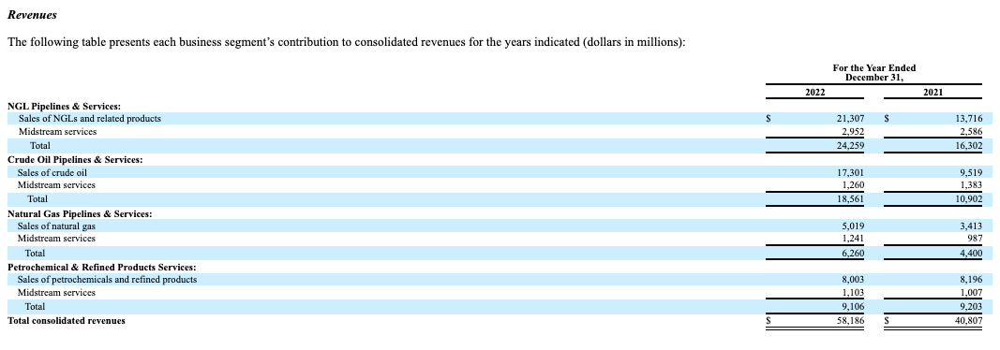
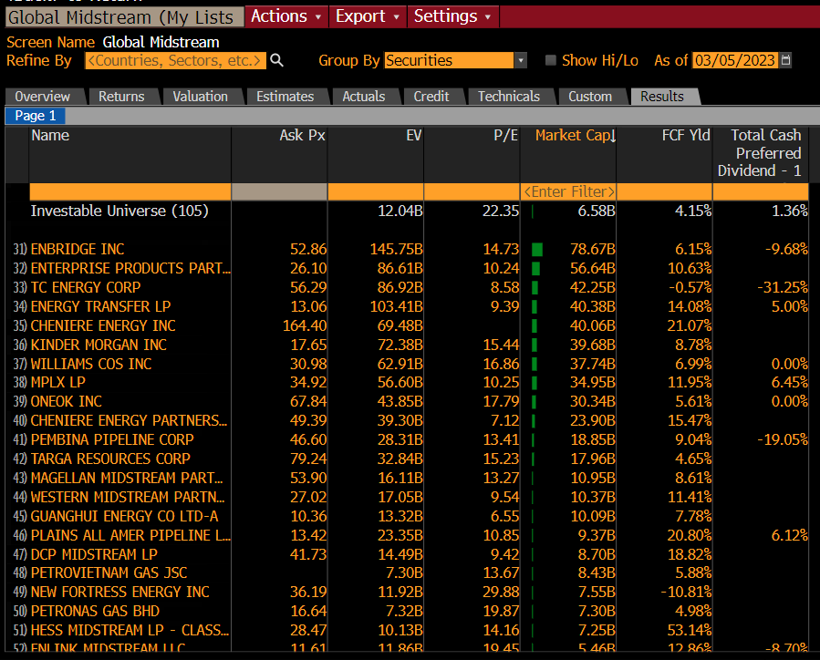

# Analysis of [ENTERPRISE PRODUCTS PARTNERS L.P.](https://www.sec.gov/edgar/browse/?CIK=1061219&owner=exclude)

### Introduction

Enterprise (EPD) is a limited partnership that specializes in the
sale and delivery of commodities including natural gas, crude oil,
petrochemical, and other refined products. EPD markets themselves as a
_midstream energy asset network (or "value chain")_. Their operations include
the excavation, processing, refining, transporting and storing of crude oil,
NGLs (or "natural gas liquids"), natural gas, petrochemical, and other refined
energy products.

EPD owns 23 NGL processing facilities all across the United States that have the
ability to process 10.85 billion cubic feet of liquid natural gas per day which
are at a weighted-average utilization rate of 66.5% as of Q4 2022.

Other ventures include the twenty-thousand miles of NGL pipelines, twenty-one different
storage facilities, six-thousand miles of crude oil pipelines, seven crude oil terminals,
twenty-thousand miles of natural gas pipelines, and seven petrochemical processing plants.

Several attributes of
EPD are appealing to investors, such as their generous `7.3%` dividend
(as of 3/5/23), of which has increased year over year since their inception
in 1968. There large dividend is of course due to their operation as a K-1
Limited Partnership (don't buy in your Roth!). Enterprise has a market cap of
approximately $56.6 billion and trades at $26.09 per share as of early March.

EPD reports a meager $76 million in cash and equivalents, but with $28.9 billion in
debt, Enterprise has an operational value (EV) of $86.6 Billion, which is very
similar to EPD's direct peers.

Another advantage of EPD, and midstream in general, is that it allows investors
to have exposure to the commodities while limiting some of the volatility and
downside risk. Many investors believe EPD to be solely a midstream company, however,
according to their most recent 10K filing, EPD makes approximately 88% of it's revenue
from the direct sale of commodities:

<!-- ### Midstream Market

There are approximately 100 other midstream companies (globally):

 -->

### Financial Analysis

See the attached, `model-EPD.xlsx` to see EPD's cash flow, balance sheet, and income modeled
for the trailing twelve quarters. This model attempts to reverse engineer the market's pricing
and apply that on a look-forward basis.

> By the way, this model was automatically generated with software I wrote (this repository)
> called `automodel`. [Check it out](https://github.com/carterjfulcher/automodel) and create
> your own models with this tool.

### Analyst Recommendations

84% of analysts suggest buying EPD, while the other 16% are recommending a hold. The general
consensus on a twelve month target price is $31.66 (+21.3%). JP Morgan analyst Jeremy Tonet
highlighted the $300 million increase in assets under construction, 580 miles of pipeline
purchased, and $400 million growth in capex.

> EPD’s Four Operating Segments Produced Mixed Results, But Overall Still Strong. Despite global GDP growth weakening throughout 2022, demand for crude oil, natural gas, NGLs, and petrochemicals remained strong overall, and so did the commodity price environment (although pullbacks in commodity prices were more evident in 4Q22). Despite the challenging market environment, EPD’s total gross operating margin continued to show strength, up 11.8% to $2.400 billion compared with $2.146 billion a year ago. Overall, the gains in gross operating margin in EPD’s NGL Pipeline & Services and Onshore Natural Gas Pipeline & Services segments were up significantly and more than offset the slight weakness in gross operating margin in EPD’s Onshore Crude Oil Pipelines & Services and Petrochemical & Refined Products Services segments
> Source: Jones Research

Over all, EPD looks strong in analyst ratings:

### Conclusion

### Sources

[Midstream EV Comparisons](./EVComparisonsMidstream.xlsx)
[EPD Financial Model](./model-EPD.xlsx)
[Jones Research Q4 Commentary](./JonesTrading%20EPD%20Finishing%202022%20With%20Better-Than-Expected%204Q22%20Results%3B%20W.pdf)
