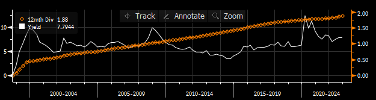

# [ENTERPRISE PRODUCTS PARTNERS L.P.](https://www.sec.gov/edgar/browse/?CIK=1061219&owner=exclude)

### Introduction

Enterprise (EPD) is a limited partnership that specializes in the
sale and delivery of commodities including natural gas, crude oil,
petrochemical, and other refined products. Several attributes of
EPD are appealing to investors, such as their generous `7.3%` dividend
(as of 3/5/23), of which has increased year over year since their inception
in 1968. There large dividend is of course due to their operation as a K-1
Limited Partnership (don't buy in your Roth!). Enterprise has a market cap of
approximately $56.6 billion and trades at $26.09 per share as of early March.

EPD reports a meager $76 million in cash and equivalents, but with $28.9 billion in
debt, Enterprise has an operational value (EV) of $86.6 Billion, which is very
similar to EPD's direct peers.

<!--  -->

EPD also allows investors to have exposure to the commodities while limiting
some of the volatility and downside risk. Many investors believe EPD to be
a primarily midstream company, however, according to their most recent 10K
filing, EPD makes approximately 88% of it's revenue from the sale of commodities
themselves:

